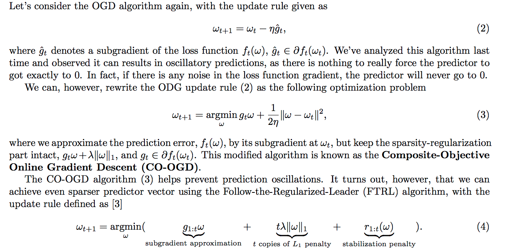

[Follow-the-Regularized-Leader and Mirror Descent: Equivalence Theorems and L1 Regularization][1]

[Lectures notes of CS599s][2]

FTRL 是对参数做正则的方式，包括 L1 和 L2

[1]: https://research.google.com/pubs/archive/37013.pdf
[2]: https://courses.cs.washington.edu/courses/cse599s/12sp/scribes/Lecture8.pdf