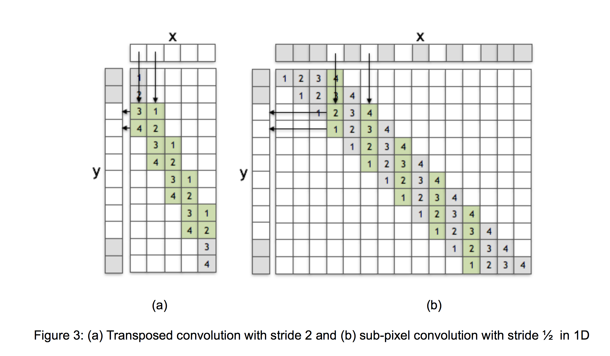

### What is conv?

To understand what is `deconv`, we first need to understand what is conv. Convolution neural network
is very successuful in extracting features from images and it is transaction invariant.

For a normal convultion layer, we need kernels (with kernel size m\*n), stride (step size to move kernels).

For example, we have an image with size W\*H, one kernel with size m\*n, stride = s, padding equals p.

Padding is used to preprocess the images in order to get same input image size.

With previous configuration, we will get:

```
R = (W + 2 * p - m) / s + 1
C = (H + 2 * p - n) / s + 1
```

After convolution, we reduce the images from W\*H to m\*n (Assume that padding takes no effect).

### What is deconv



We show
